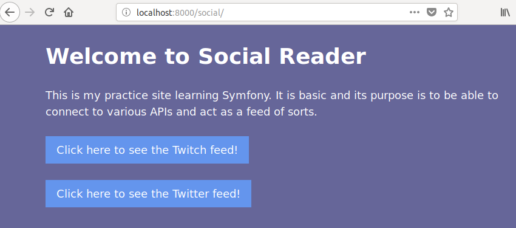
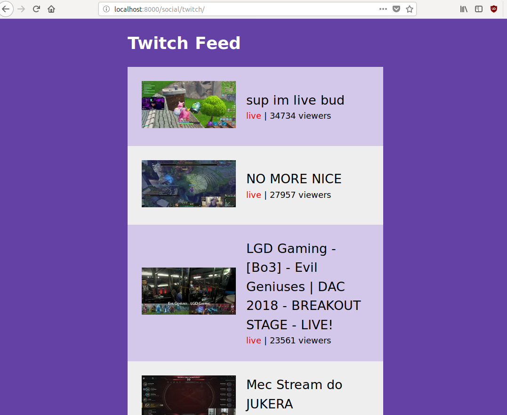
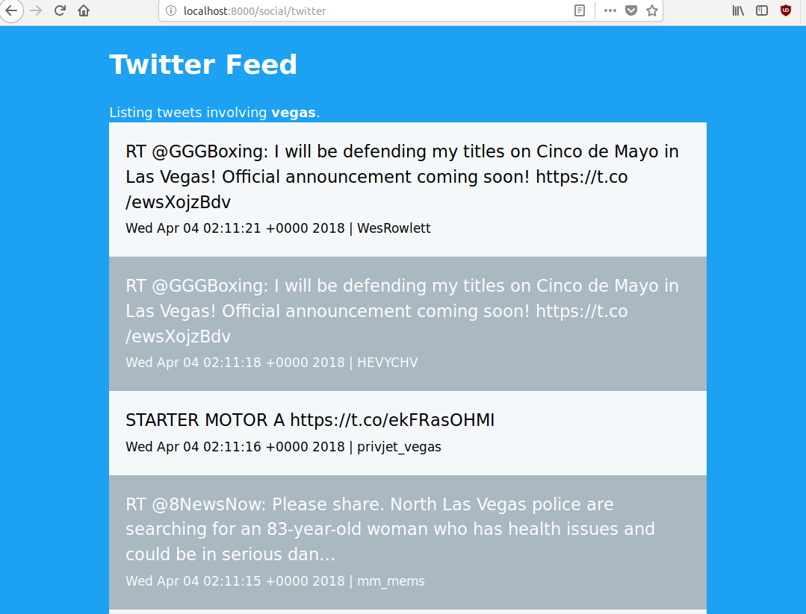
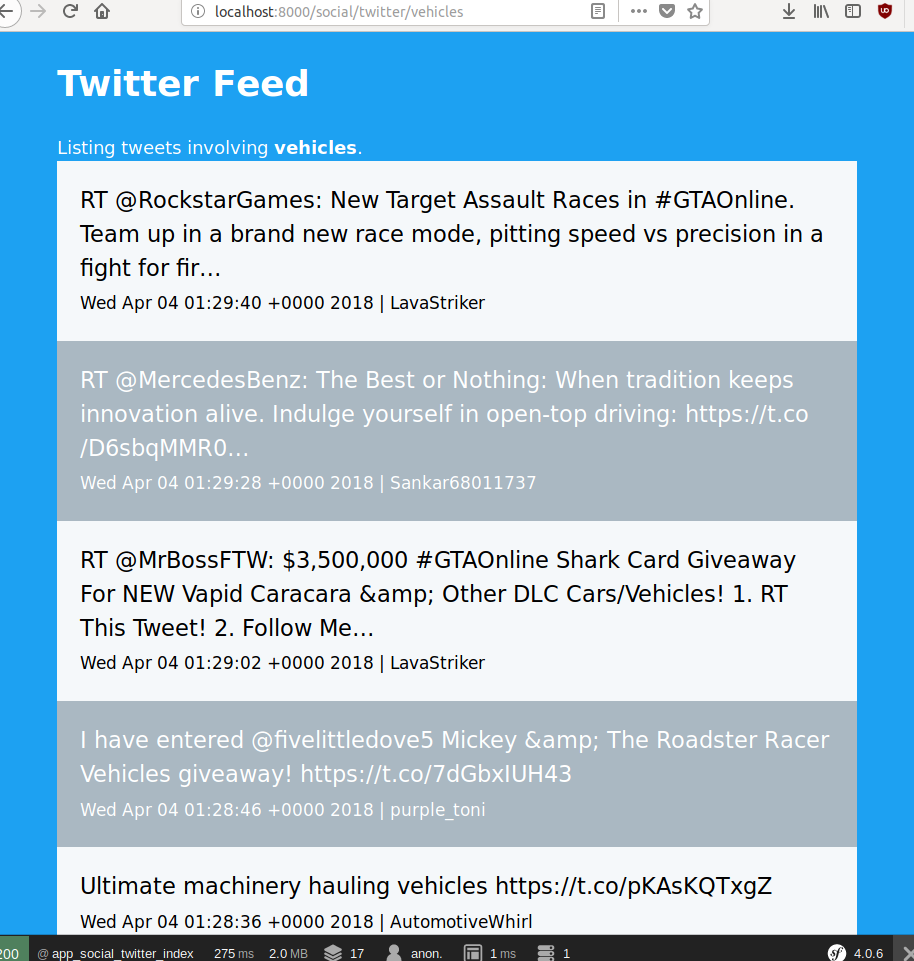

Social Reader is a quick project showing the basics of Symfony 4 and Doctrine as I learn them.  It uses the Twitter and Twitch APIs to give you a limited feed.

The Twitch feed will currently show the top streams.

The Twitter feed will default to a search of Vegas tweets:

or you can change the URL to have it search for tweets based on a different term.

You will need to customize the .env file and modify your Symfony, database, and API configuration variables